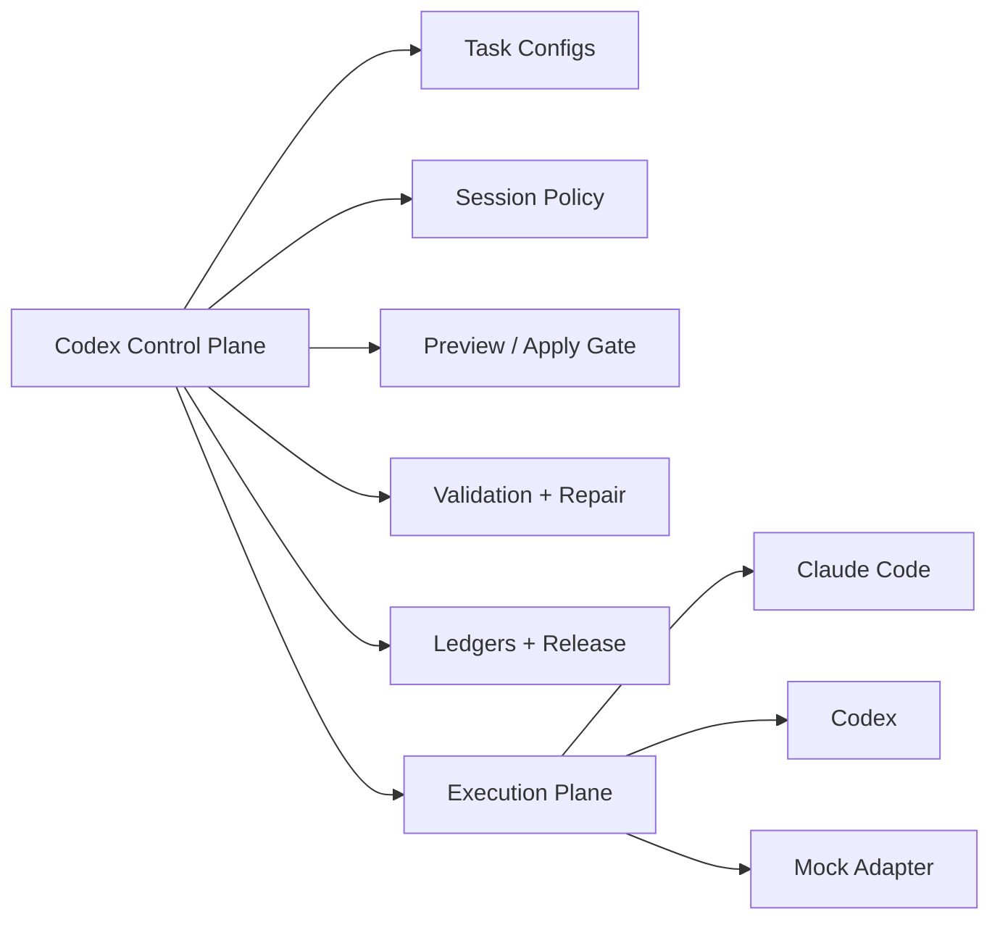

# Codex Claude Orchestrator

[English](./README.md) | [简体中文](./README.zh-CN.md)

Codex Claude Orchestrator is a publishable control-plane extension for Codex. It packages four layers into one installable unit:

- a local CLI runtime for repeatable task execution
- a local stdio MCP server for structured tool access
- a Codex plugin manifest and skill for discoverability
- release packaging for marketplace-style distribution

The design goal is simple: let Codex stay in charge of planning, validation, preview/apply policy, and release hygiene, while Claude Code, Codex, or a mock adapter handles the actual generation work.

## Why this exists

Many agent setups collapse control and execution into one prompt loop. This project deliberately separates them:



That split is useful when:

- the task is long-running
- the workflow is repeated across many documents
- a preview artifact must be reviewed before formal landing
- you want Codex to orchestrate Claude Code instead of prompting it ad hoc

A quick rule of thumb is:

```text
orchestration_value = governance + repeatability + recoverability
```

If `coordination_cost > orchestration_value`, you should probably use one agent directly.

## What ships in this plugin

```text
plugins/codex-claude-orchestrator/
  .codex-plugin/plugin.json
  .mcp.json
  bin/
    cco.mjs
    cco-mcp-server.mjs
  docs/
  examples/
  scripts/
  skills/
```

## Install paths

If you are testing on another computer, start with the dedicated guide:

- [Install Guide](./docs/INSTALL.md)

## Reinstall for iterative testing

If you are repeatedly testing new versions, remove the old `cco` registration first and then reinstall:

```powershell
cd <repo-root>\plugins\codex-claude-orchestrator
powershell -ExecutionPolicy Bypass -File .\scripts\uninstall-codex-extension.ps1 -Alias cco -KeepMarketplace
powershell -ExecutionPolicy Bypass -File .\scripts\install-codex-extension.ps1 -Force
```

If you want a full clean reset including the marketplace registration:

```powershell
cd <repo-root>\plugins\codex-claude-orchestrator
powershell -ExecutionPolicy Bypass -File .\scripts\uninstall-codex-extension.ps1 -Alias cco
```

## What to tell Codex

If you want Codex to do the entire setup for you, paste this:

```text
Please deploy and verify codex-claude-orchestrator from GitHub using HTTPS only.

1. Clone `https://github.com/ChengyuWang0807/codex-claude-orchestrator.git`.
2. Enter `.\codex-claude-orchestrator\plugins\codex-claude-orchestrator`.
3. If Codex login is required, tell me to run `codex login --with-api-key` first.
4. If an old `cco` install exists, run `powershell -ExecutionPolicy Bypass -File .\scripts\uninstall-codex-extension.ps1 -Alias cco -KeepMarketplace` first.
5. Run `powershell -ExecutionPolicy Bypass -File .\scripts\install-codex-extension.ps1 -Force`.
6. Run `codex mcp get cco --json`.
7. Run `node .\scripts\test-mcp-server.mjs`.
8. Run `node .\bin\cco.mjs run --config .\examples\tasks\mock-doc-preview.json --json`.
9. Tell me whether clone, uninstall, installation, MCP wiring, and the mock preview workflow all succeeded. If anything fails, show the failing step and the fix.
```

### Option 1: Codex plugin + MCP

If you want the full Codex experience:

```powershell
cd plugins/codex-claude-orchestrator
powershell -ExecutionPolicy Bypass -File .\scripts\install-codex-extension.ps1
```

This does two things:

- adds the bundled marketplace root when one is available
- registers the local MCP server as `cco`

### Option 2: API-key users without ChatGPT account UI

This project also works in API-key-only Codex environments:

```powershell
codex login --with-api-key
codex mcp add cco -- node D:\path\to\plugins\codex-claude-orchestrator\bin\cco-mcp-server.mjs
```

That path is the most important install contract for headless or portable use.

## Validate the install

```powershell
node .\bin\cco.mjs doctor
codex mcp get cco --json
node .\scripts\test-mcp-server.mjs
```

The bundled MCP smoke test covers:

- initialize handshake
- tools/list
- `cco_doctor`
- `cco_list_tasks`
- `cco_run_task`
- `cco_get_run_status`
- `cco_apply_preview_artifact`

## MCP tools

The local MCP server exposes task-oriented tools instead of raw shell passthrough:

| Tool | Purpose |
| --- | --- |
| `cco_doctor` | Check runtime and provider availability |
| `cco_list_tasks` | Inspect bundled task configs |
| `cco_run_task` | Execute a config with preview/apply policy |
| `cco_get_run_status` | Inspect the latest or a specific run |
| `cco_list_sessions` | List persistent task-session bindings |
| `cco_apply_preview_artifact` | Promote a preview artifact into the formal target |

The bias is intentional: high-level tools are harder for the upper-layer agent to misuse.

## CLI commands

```text
cco doctor
cco tasks
cco sessions
cco status
cco apply
cco run
cco watch
cco pack
```

## Sample workflow

1. Inspect the available tasks.
2. Run the mock preview task.
3. Inspect the generated artifact.
4. Apply the preview artifact to the formal path.

```powershell
node .\bin\cco.mjs tasks --dir .\examples\tasks
node .\bin\cco.mjs run --config .\examples\tasks\mock-doc-preview.json
node .\bin\cco.mjs status --config .\examples\tasks\mock-doc-preview.json
node .\bin\cco.mjs apply --config .\examples\tasks\mock-doc-preview.json
```

Artifacts are written under:

```text
examples/workspace/.cco/sandbox/<task-name>/runs/<run-id>/
```

Formal applied files land under:

```text
examples/workspace/generated/
```

## Provider matrix

| Provider | External install | Persistent session | Best use |
| --- | --- | --- | --- |
| `claude` | Claude Code CLI | Yes | High-density writing driven by Claude Code |
| `codex` | Codex CLI | Yes or ephemeral | Codex-native execution or API-only environments |
| `mock` | None | No | Demos, CI smoke tests, onboarding |

## Release packaging

Build a release bundle like this:

```powershell
node .\bin\cco.mjs pack
```

The output is a marketplace-style release root plus a zip archive:

```text
dist/codex-claude-orchestrator-v0.2.0/
dist/codex-claude-orchestrator-v0.2.0.zip
```

The staged release contains:

- `.agents/plugins/marketplace.json`
- `plugins/codex-claude-orchestrator/...`
- `release-manifest.json`

That means a user can unzip the release and run:

```powershell
codex plugin marketplace add <release-root>
```

## Development notes

- `scripts/test-mcp-server.mjs` is the fastest end-to-end validation path.
- `scripts/start-watchdog.ps1` can re-run a task on a fixed interval.
- `scripts/uninstall-codex-extension.ps1` removes the MCP entry and optional marketplace registration.

## Project value in one sentence

This project turns "Codex as upper-layer manager, Claude Code as execution specialist" into a reusable open-source extension that also works in Codex-only or API-key-only environments.
