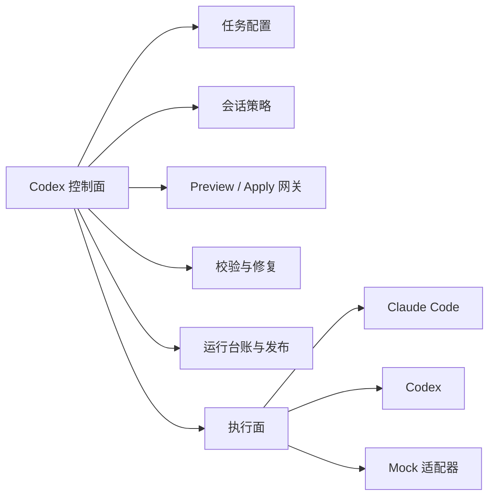

# Codex Claude Orchestrator

[English](./README.md) | [简体中文](./README.zh-CN.md)

Codex Claude Orchestrator 是一个面向 Codex 的可发布控制面扩展。它把四层能力打包在一起：

- 用于可重复任务执行的本地 CLI 运行时
- 用于结构化工具接入的本地 stdio MCP Server
- 便于 Codex 发现和触发的插件 manifest 与 Skill
- 面向 marketplace 风格分发的 release 打包能力

这个项目的核心目标很明确：让 Codex 负责规划、校验、preview/apply 策略和发布治理，让 Claude Code、Codex 或 mock 适配器专注于实际生成。

## 为什么要做这个项目

很多 agent 工作流把控制逻辑和执行逻辑都塞进一个 prompt 循环里。这个项目刻意把它们拆开：



这种拆分尤其适合下面几类场景：

- 任务会持续很久
- 同一类工作流会反复执行
- 生成结果需要先 review，再决定是否正式落地
- 你希望 Codex 稳定编排 Claude Code，而不是每次靠临时提示词吩咐

一个很实用的判断公式是：

```text
编排价值 = 治理能力 + 可复用性 + 可恢复性
```

如果 `协调成本 > 编排价值`，那就没必要强行上双层系统，直接用单个 agent 反而更好。

## 插件里包含什么

```text
plugins/codex-claude-orchestrator/
  .codex-plugin/plugin.json
  .mcp.json
  bin/
    cco.mjs
    cco-mcp-server.mjs
  docs/
  examples/
  scripts/
  skills/
```

## 安装路径

如果你是在另一台电脑上测试，优先看：

- [Install Guide](./docs/INSTALL.md)

### 方案 1：Codex 插件 + MCP

如果你想完整体验 Codex 侧的安装形态：

```powershell
cd plugins/codex-claude-orchestrator
powershell -ExecutionPolicy Bypass -File .\scripts\install-codex-extension.ps1
```

这一步会做两件事：

- 如果上层存在 marketplace 根目录，就把它注册进去
- 把本地 MCP Server 注册为 `cco`

### 方案 2：API key 用户，无需 ChatGPT 账号 UI

这个项目同样支持纯 API 的 Codex 环境：

```powershell
codex login --with-api-key
codex mcp add cco -- node D:\path\to\plugins\codex-claude-orchestrator\bin\cco-mcp-server.mjs
```

这条命令是最重要的“可移植安装契约”，特别适合 headless 或多机器切换的场景。

## 如何验证安装成功

```powershell
node .\bin\cco.mjs doctor
codex mcp get cco --json
node .\scripts\test-mcp-server.mjs
```

内置的 MCP 冒烟测试会覆盖：

- initialize 握手
- tools/list
- `cco_doctor`
- `cco_list_tasks`
- `cco_run_task`
- `cco_get_run_status`
- `cco_apply_preview_artifact`

## MCP 工具列表

本地 MCP Server 暴露的是“任务级工具”，不是原始 shell 透传：

| 工具 | 用途 |
| --- | --- |
| `cco_doctor` | 检查运行时与 provider 是否可用 |
| `cco_list_tasks` | 查看内置任务配置 |
| `cco_run_task` | 按 preview/apply 策略执行任务 |
| `cco_get_run_status` | 查看最新一次或指定 run 的状态 |
| `cco_list_sessions` | 查看任务与持久会话的绑定关系 |
| `cco_apply_preview_artifact` | 把 preview 产物提升为正式目标文件 |

这种高语义工具设计是故意的，因为越高层的工具契约，越不容易被上层 agent 误用。

## CLI 命令

```text
cco doctor
cco tasks
cco sessions
cco status
cco apply
cco run
cco watch
cco pack
```

## 一个最小完整工作流

1. 查看可用任务
2. 运行 mock preview 任务
3. 查看生成产物
4. 决定是否 apply 到正式路径

```powershell
node .\bin\cco.mjs tasks --dir .\examples\tasks
node .\bin\cco.mjs run --config .\examples\tasks\mock-doc-preview.json
node .\bin\cco.mjs status --config .\examples\tasks\mock-doc-preview.json
node .\bin\cco.mjs apply --config .\examples\tasks\mock-doc-preview.json
```

preview 产物会写到：

```text
examples/workspace/.cco/sandbox/<task-name>/runs/<run-id>/
```

正式 apply 后的文件会落到：

```text
examples/workspace/generated/
```

## Provider 对比

| Provider | 额外安装 | 持久会话 | 适合场景 |
| --- | --- | --- | --- |
| `claude` | Claude Code CLI | 是 | 让 Claude Code 负责高密度文档生成 |
| `codex` | Codex CLI | 是或临时 | 纯 Codex 环境，或 API-only 环境 |
| `mock` | 无 | 否 | Demo、CI 冒烟测试、首次安装验证 |

## Release 打包

你可以这样构建 release：

```powershell
node .\bin\cco.mjs pack
```

输出是一个 marketplace 风格的 release 根目录和一个 zip 包：

```text
dist/codex-claude-orchestrator-v0.2.0/
dist/codex-claude-orchestrator-v0.2.0.zip
```

打包后的目录里包含：

- `.agents/plugins/marketplace.json`
- `plugins/codex-claude-orchestrator/...`
- `release-manifest.json`

这意味着外部用户解压之后可以直接执行：

```powershell
codex plugin marketplace add <release-root>
```

## 开发提示

- `scripts/test-mcp-server.mjs` 是最快的端到端验证路径
- `scripts/start-watchdog.ps1` 可以按固定时间间隔重跑任务
- `scripts/uninstall-codex-extension.ps1` 可以移除 MCP 注册和可选的 marketplace 注册

## 一句话总结项目价值

这个项目把“Codex 做上层管理器，Claude Code 做下层执行专家”这件事，沉淀成了一套可复用、可安装、可开源发布的生态扩展，并且它在纯 Codex 或纯 API 的环境中同样可用。
