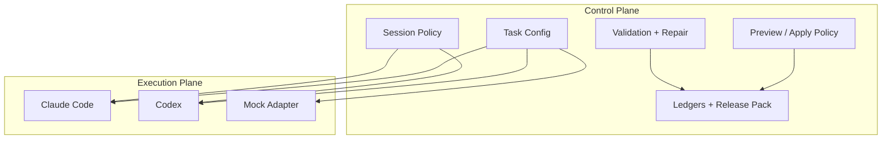

# Architecture

## Overview

Codex Claude Orchestrator is intentionally split into a control plane and an execution plane.



## Layer responsibilities

- The CLI runtime owns task loading, session state, validation, preview/apply landing, ledgers, and release packaging.
- The MCP server exposes the runtime as structured tools so Codex can call it safely.
- The plugin and skill make the capability installable and discoverable.
- The execution adapters only generate the content.

## Lifecycle

```text
task.json
  -> build prompt
  -> inject context files
  -> resolve session state
  -> invoke provider
  -> validate output
  -> optionally repair
  -> write preview artifact
  -> optionally apply formal file
  -> append ledgers
```

## Safety model

The project is built around preview-first orchestration:

```text
formal_write_risk = model_error_probability * landing_impact
```

Preview mode lowers `landing_impact` before a human or a second pass decides whether the artifact should be applied.

## Design rule

Expose high-level task tools, not raw provider passthrough. In practice:

- good: `cco_run_task`, `cco_get_run_status`, `cco_apply_preview_artifact`
- bad: `run_claude(prompt)`, `run_shell(command)`

The more semantic the tool contract is, the less likely the upper-layer agent is to drift.
